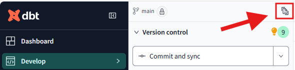

# 🏆 **The Heroic Solution**

Here’s how you can solve the **Findable** part of our quest:

1. **Create the `schema.yml` file** for the `winners` model in the `models` folder:

```yaml
version: 2

models:
  - name: top_citizens
    description: "This model retrieves the top 3 citizens by number of quests completed, along with their height and the most used weapon."
    config:
      tags:
        - "prize"
        - "citizens"
        - "quests"
        - "items"
    columns:
      - name: citizen_id
        description: "The unique identifier for each citizen."
      - name: first_name
        description: "The first name of the citizen."
      - name: last_name
        description: "The last name of the citizen."
      - name: date_of_birth
        description: "The date of birth of the citizen in ISO format."
      - name: height_cm
        description: "The height of the citizen in centimeters."
      - name: total_quests
        description: "The total number of quests the citizen has completed."
      - name: most_used_item
        description: "The item that the citizen used most frequently in their quests."
      - name: most_used_item_length_cm
        description: "The length of the most used weapon in centimeters."
```

2. Run dbt Docs to Generate Documentation

In the command line, run:

```bash
dbt docs generate
```

And then click on the document button as shown below:



This will spin up a local web server where you can view the documentation for your project. It will allow you to see your models, tags, columns, and their descriptions. 📜

3. Test the Findability

Try to search for the model and its columns by using the search bar. Can you easily find the `top_citizens` model? If so, the kingdom is now ready to easily discover it! 🔍
