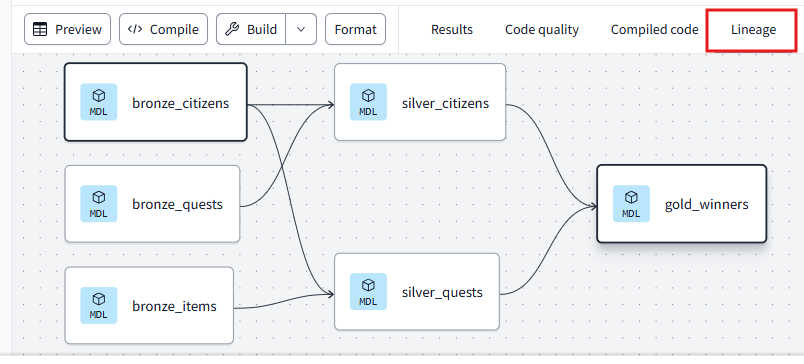

# 🏆 **The Heroic Solution**

Here’s how you can tackle the **code cleanup** and **optimization** tasks:

## 1. **Use `ref()`**

To eliminate the hardcoded references, we should use `ref()` for each model but **not sources** (i.e. excluding files in folder `models/bronze`). This ensures the correct **order of execution** and simplifies future model dependencies. See this example:

```sql
SELECT
    cq.citizen_id,
    cq.first_name,
    cq.last_name,
    cq.date_of_birth,
    cq.height_centimeters,
    cq.total_quests,
    mw.most_used_item,
    mw.most_used_item_length_centimeters

FROM {{ ref('silver_citizens') }} AS cq -- Using ref() for the silver_citizens model

LEFT JOIN {{ ref('silver_quests') }} AS mw -- Using ref() for the silver_quests model
    ON cq.citizen_id = mw.citizen_id

ORDER BY
    cq.total_quests DESC
```

---

## 2. **Refactor Date Logic into a dbt Model or Macro**

There’s a lot of repeated logic around **date formatting** in our queries. Let's create a **macro** in `macros/format_date.sql`:

```sql

    TO_CHAR(TO_DATE({{ date_column }}, 'dd/MM/yyyy'), 'yyyy-MM-dd')

```

Now, we can simply call the macro in our models that need date reformatting (`bronze_citizens.sql` and `bronze_quests.sql`). See the example below:

```sql
SELECT
    citizen_id,
    first_name,
    last_name,
    race,
    {{ format_date('date_of_birth') }}      AS date_of_birth,  -- <--- Updated to use the macro
    ROUND(height_centimeters * 30.48)       AS height_centimeters

FROM {{ source('raw', 'citizens') }}
```

This avoids repetition and keeps your code DRY. 🌟

---

## 3. **Implement Source Freshness Tests**

Now, we need to make sure that the **raw data** is up to date. To do this, we can add a **freshness test** to the `schema.yml` for the sources. Add this to your `schema.yml` for `citizens`, `quests`, and `items`:

```yaml
version: 2

sources:
  - name: raw
    database: ws_ejvind
    schema: raw # <-- the schema name where your raw data tables live
    tables:
      - name: citizens
        freshness:
          warn_after: { count: 1, period: hour } # warning if data is more than 1 hour old
          error_after: { count: 30, period: day } # error if data is more than 2 hours old
        loaded_at_field: uploaded_timestamp # field that tracks when the data was last updated
      - name: quests
        freshness:
          warn_after: { count: 1, period: hour }
          error_after: { count: 30, period: day }
        loaded_at_field: uploaded_timestamp
      - name: items
        freshness:
          warn_after: { count: 1, period: hour }
          error_after: { count: 30, period: day }
        loaded_at_field: uploaded_timestamp
```

This will ensure that the kingdom’s data is up to date. If the data is stale, you will receive a **warning** or **error**, depending on how old it is. ⚠️

Now to check the current freshness status, run:

```bash
dbt source freshness
```

## 4. **Run the Final Pipeline**

Since we have added the `ref()` for each table, dbt is capable of understanding model dependencies alone. So simply run

```bash
dbt run
```

Now, click on the `gold_winners.sql` file and in the console you will be able to see its full lineage, like shown below.



Finally, click on "Preview" to see the top 3 winners with columns adjusted to have the correct formats.
